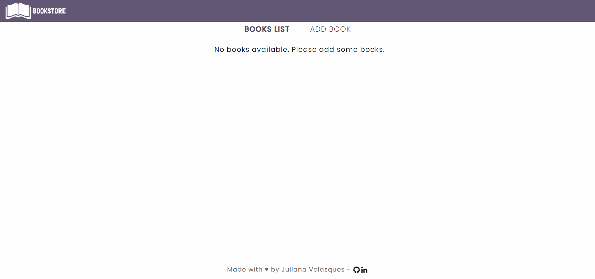

<h1 align="center"> Management BookStore <h1>

<h4 align="center">
  🚀 An APP for product inventory.
</h4>

  
  
  
  

  

  

  <a href="#page_with_curl-about">About</a>&nbsp;&nbsp;&nbsp;|&nbsp;&nbsp;&nbsp;
  <a href="#wrench-built-with">Built With</a>&nbsp;&nbsp;&nbsp;|&nbsp;&nbsp;&nbsp;
  <a href="#-how-to-contribute">How to Contribute</a>&nbsp;&nbsp;&nbsp;|&nbsp;&nbsp;&nbsp;
  <a href="#memo-license">License</a>

  
## Demonstration

## 💻 Live Preview

You can access this application [HERE](https://management-book-store.vercel.app/). 

## :page_with_curl: About

The Book Store Management app was created to be an inventory of the store's products. This an e-commerce system for product inventory. Data entered by users is stored in Local Storage.

#### Motivation
This app was created to fulfill a Hiring Coders bootcamp assignment carried out by VTEX in partnership with Gama Academy.

## :wrench: Built With

- [ReactJS](https://reactjs.org/)
- [Bootstrap](https://getbootstrap.com/docs/4.5/getting-started/introduction/)
- [SCSS](https://sass-lang.com/)
- [JavaScript](https://www.javascript.com/)

## 🤔 How to Contribute

- Clone the project: `git clone git@github.com:Silve1ra/casting-agency-app.git`;
- Create your branch with your feature: `git checkout -b my-feature`;
- Install the dependencies: `npm install`
- Run the application: `npm start`
- Access the application: `http://127.0.0.1:3000/` by default.
- Commit your feature: `git commit -m 'feat: My new feature'`;
- Push to your branch: `git push -u origin my-feature`.

After the merge of your pull request is done, you can delete your branch.

## :memo: License

This project is under the MIT license. See the [LICENSE](LICENSE.md) file for more details.

---

Made with ♥ by <tr>
    <td align="center"><a href="https://github.com/JulianaVelasques"><b>Juliana Velasques</b></a> </td>
<tr>

